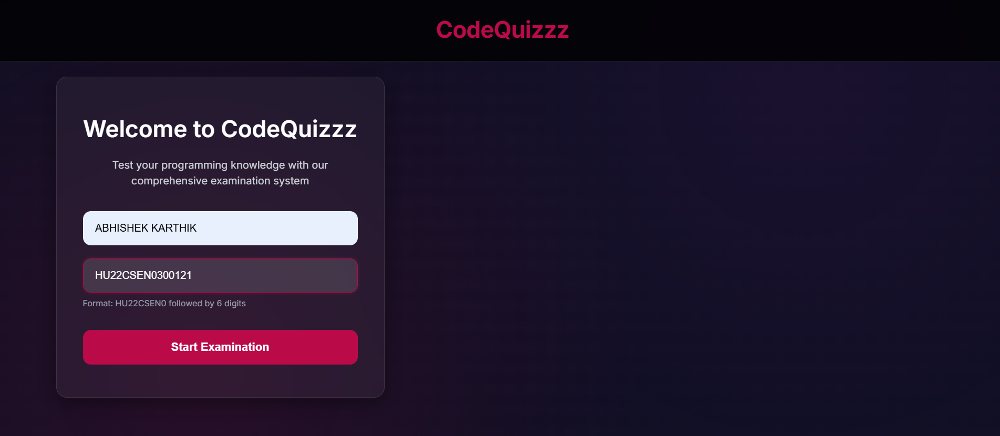
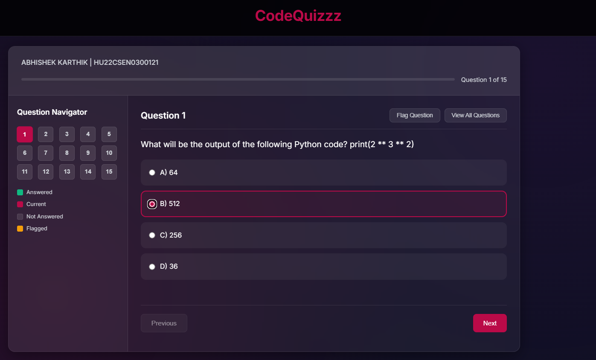
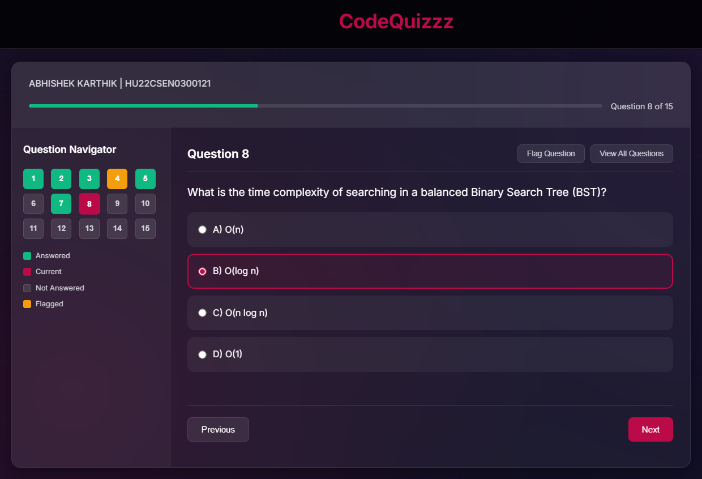
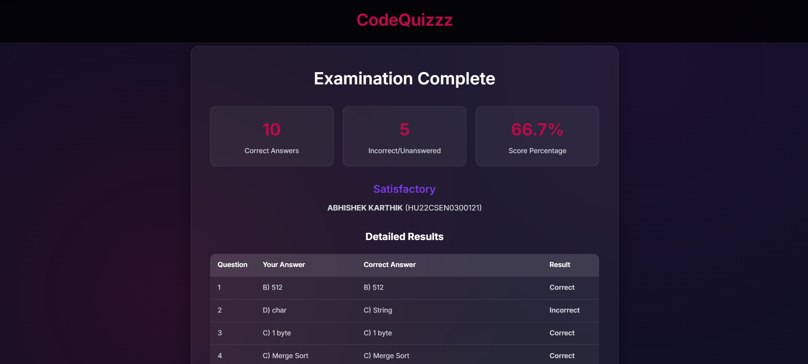

# CodeQuizzz – Online Examination System  

An interactive online examination system that allows students to attempt multiple-choice questions (MCQs), track progress, and view results at the end.  

## Features  
- User details input (Name, Roll Number) before starting exam  
- 15 MCQs stored in arrays (JavaScript)  
- Question navigation with status indicators (Answered, Not Answered, Current, Flagged)  
- Option to view questions one by one or all at once  
- Progress bar showing current question status  
- Final result summary with detailed answer evaluation  
- Option to retake exam or print results  


## Technologies Used  
- **HTML5** – Page structure  
- **CSS3** – Styling and responsiveness  
- **JavaScript (ES6+)** – Quiz logic and evaluation  

## How to Run  
1. Clone this repository  
   ```bash
   git clone https://github.com/your-username/codequizzz.git
   cd codequizzz
   ```
    Open index.html in any modern browser.

## Screenshots
1. Welcome Page: User enters Name and Roll Number before starting.

2. Quiz Page: Displays questions, options, and navigation grid.

3. Shows progress bar and allows flagging questions.

4. Result Page: Shows summary of correct, incorrect, and unanswered questions.


## File Structure
``` bash
=📂 codequizzz
 ┣ 📜 index.html   # Main HTML file
 ┣ 📜 style.css    # Styling
 ┣ 📜 script.js    # Quiz logic
 ┗ 📜 README.md    # Documentation
 ```

## Creators
- Developed by Mahi Shukla, Abhishek Karthik